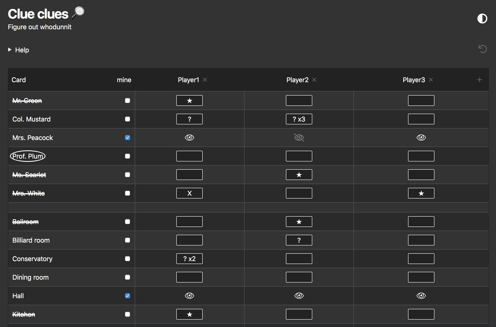

# Clue Clues 🔎

 

Track clues for the whodunnit murder mystery game [Clue](https://en.wikipedia.org/wiki/Cluedo).

[https://clues.netlify.app](https://clues.netlify.app)

## Help

- Click player name to edit.
- Click + to add player.
- Click x to remove player.
- Check the mine box for your cards to track who's seen them.
- Click card names to cross them off (not it) or circle them (it).
- Click player card buttons to cycle through 6 states:
  1. unknown (empty)
  2. maybe (?)
  3. maybe x2 (? x2)
  4. maybe x3 (? x3)
  5. does not have card (X)
  6. has card (★)
- Click ↺ to reset clues. _Data is stored in the browser, not on the server_.

---

✌️ Bear Club!

